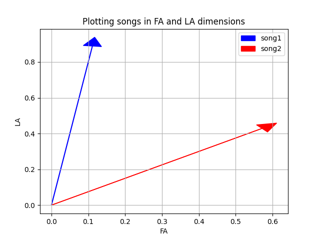
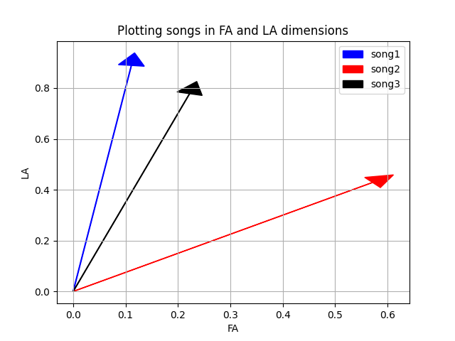
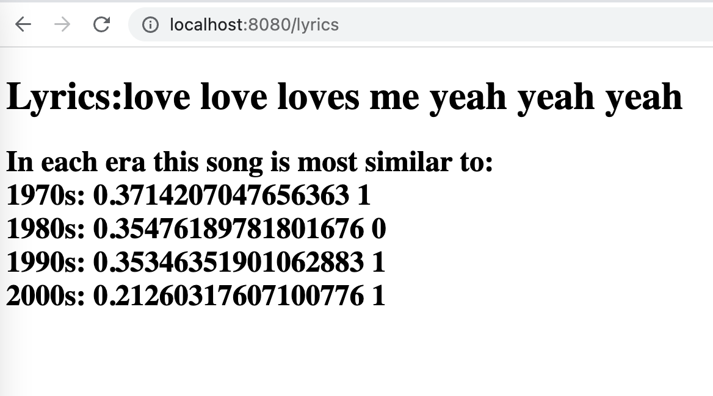

## One Hit Wonders

To help understand thist consider for a minute that songs might only be comprised of 2 words: FA or LA.

Thus: `FA LA LA LA LA LA LA LA LA`, and
`FA LA FA LA FA LA FA`
Are both valid songs.

If we consider that our world of possible song words contains only FA or LA then we might consider these to be dimensions (the FA dimension and the LA dimension) and if we counted each of the FA's and LA's in a song we could represent a song as a vector pointing in the FA:LA 2D space. The first entry in the vector is the percentage of words that are FA and the 2nd entry is the percentage of words that are LA.

For example the first song above could be represented as a vector: [1/9, 8/9]. Whereas the second song could be represented as the vector: [4/7, 3/7].

Now we might consider a third song:

`FA LA LA FA LA LA LA LA LA`

in FA:LA space this is the vector: [2/9, 7/9]

Is song 3 more similar to song 1 or song 2? To answer this question we can compare the vectors to see which one song 3 is most similar to.

In the above we see that song 3 is more similar to song 1 (the vectors point in a similar direction. It might not always be easy to determine visually which songs are most closely pointing in the same direction and so we might need to compute the similarity algorithmically. We can do this via the *cosine similarity* formula. Essentially for two vectors we can compute the cosine similarity as:

cosine similarity = $\frac {A \cdot B}{||A|| ||B||}$

[cosine similarity definition on wikipedia](https://en.wikipedia.org/wiki/Cosine_similarity)

Thus to compare Song 1 to Song 3 their cosine similarity is:

$Song1 \cdot Song3$ (dot product) = $1/9 * 2/9 + 8/9 * 7/9 \approx .716$
$||song1|| = \sqrt{(1/9)^2 + (8/9)^2} \approx 0.8958$
$||song3|| = \sqrt{(2/9)^2 + (7/9)^2} \approx 0.8089 $

cosine similarity = $\frac {song1 \cdot song3}{||song1|| ||song3||}  \approx 0.9881$

Whereas the cosine similarity between song2 and song3 is:

cosine similarity = $\frac {song2 \cdot song3}{||song2|| ||song3||}  \approx 0.7967$

A perfect match is 1 while orthogonal vectors will return 0 for their cosine similarity and numbers closer to 1 indicate vectors that are pointing in more similar directions. In the above the cosine similarity between song 1 and song 3 is larger than the cosine similarity between song 2 and song 3. Therefore song 3 is a closer match to song 1.

For the purposes of our assignment if ever the cosine similarity involves a divide by zero we will simply consider the result to be zero.

**The above should give an idea of how we might compare song lyrics to determine similarity**

## Overview

In this assignment you are given a dataset of all of the billboard top 100 songs (and their lyrics (minus filler words)) from 1970 to 2009 (that's songs from the 1970's, 1980's, 1990's, and 2000's (4 decades!)).

Note: The dataset is missing a few songs (for example the number 25 song from 1970 is missing).

Your task is to determine for some newly input song lyrics from the user, whether those lyrics most closely resemble a top 25 song, a song between 26 and 50, a song between 51, and 75, or a song between 76 and 100 for each of decades.

## Details

You should read in the provided dataset and organize the songs by decade and the quartile that they appear in.

The provided web front-end assumes that quartile 0 is songs ranked between 1 and 25 inclusive, quartile 1 is songs between 26 and 50 inclusive, quartile 2 is songs between 51 and 75 inclusive and quartile 3 is songs ranked between 76 and 100 songs.

The provided .csv file(s) has the following headings on line 1:

`Rank,Song,Artist,Year,Lyrics_List`

Followed by data matching those headings on each subsequent line.

You'll notice that the last field (Lyrics_List) is wrapped in quotes but that the words appear separated by commas within those quotes. Be mindful of this when you parse the files. This last field gives the lyrics for the song, however the lyrics have been cleaned somewhat to remove filler words, etc.

In order to calculate cosine similarity you'll need to know the frequency with which each word appears (in that decade for songs in that quartile).

To avoid infrequent words polluting our calculations you should remove any word that appears less than 3 times in a decade-quartile combination.

Now for any new lyrics that we encounter we can determine the Cosine_similarity of those lyrics as compared to lyrics from the 1970's songs that ranked between 1 and 25 by the following:

Compute the sorted vector of word frequencies for any word that appeared (3 times or more) in top 25 songs in that decade. For each word in the sorted vector compute the how frequently it appears in the new lyrics (as a fraction of the total words). Then compute the cosine similarity on these vectors.

Doing this for all decades and quartiles gives the best match for the given lyrics, i.e., it gives some semblance of how likely those lyrics might be a top 25 hit in the 1970's, etc. (Well maybe - we are comparing large vectors with many small frequencies after all).

## Building the website (Launching the Application)

You are given a SpringBoot application. You should be able to build the website by clicking the run button in the `OneHitWonderApplication` file. Then open your favorite web browser and navigate to:

[http://localhost:8080/lyrics](http://localhost:8080/lyrics)

The above image indicates the lyrics are most similar to a top 25 song in the 1980's (and 26 to 50 ranked songs in the other decades).

On this page you can type in lyrics (words separated by spaces in this instance) and then hit submit and the results should be tabulated indicating which quartile (0,1,2 or 3) your song lyrics look most similar to for each decade. It's not the most beautiful webpage, so feel free to improve it if you want (just don't break anything).

